# ESC
The purpose of this project is to design, assemble and test a compact 4-in-1 ESC module, which can be used for a medium-small sized drone build.
The plan is to later design a flight controller board which controls this ESC and mounts with it on a custom drone frame.

PCB Top             |  PCB Bottom
:-------------------------:|:-------------------------:
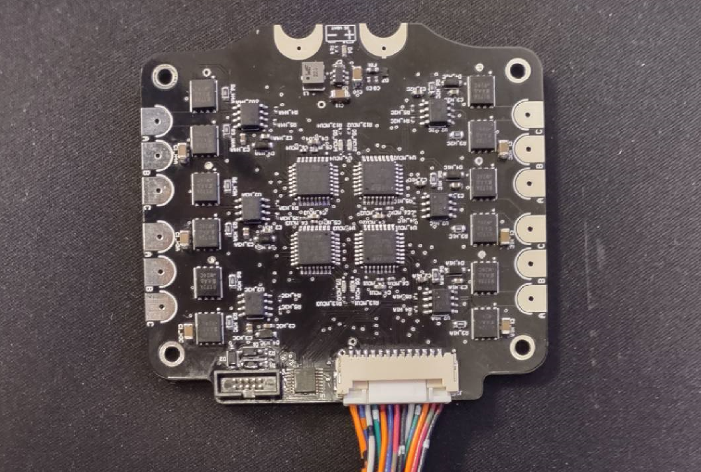  |  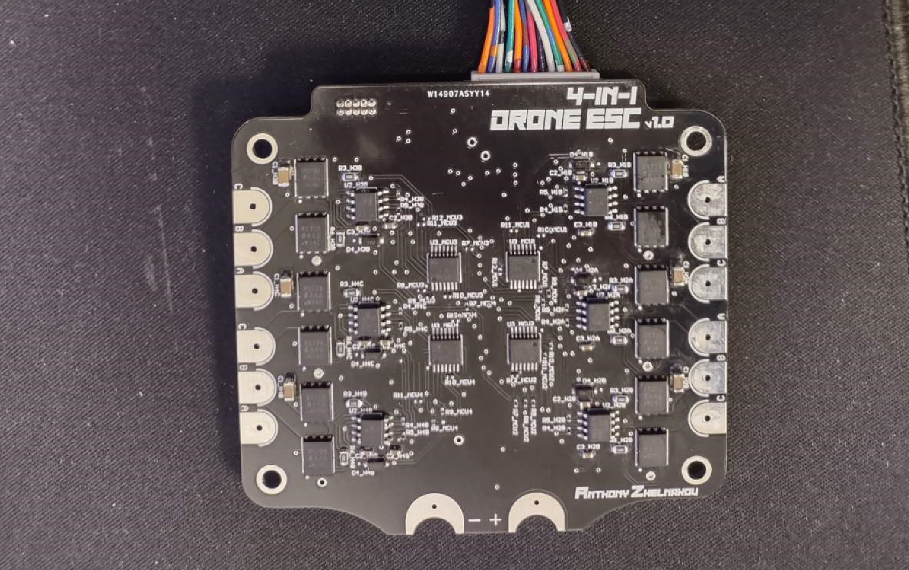

### Chapters
1. ESC Design
2. ESC Testing
3. 4-in-1 ESC PCB Design

### 1. ESC Design
I chose to make an electronic speed controller (ESC) for controlling brushless DC motors (BLDCs). BLDCs are more efficient and have a longer lifespan than brushed DC motors, and are used in pretty much any FPV drone. This made it easy for me to reference other designs and to find troubleshooting advice. I also knew the ultimate goal is something very similar to an FPV drone (I’m still undecided on the exact finished product), so the standard BLDC driver design is what I went with. 

For one ESC for driving one motor, there are 3 half bridges.  

**Half Bridge**

A half bridge circuit consists of two MOSFETs and an H-bridge driver. In my design, I use two NMOSs, as they have lower ON-resistance (resulting in lower power drain-source power dissipation while ON), so the H-Bridge uses a bootstrapping circuit to drive the high-side NMOS (while the H-bridge driver chip is supplied with ~12V, a bootstrapping capacitor gets charged up and connected to the NMOS gate, and when the HS NMOS turns ON, its gate voltage goes up to ~24V, keeping it ON). 
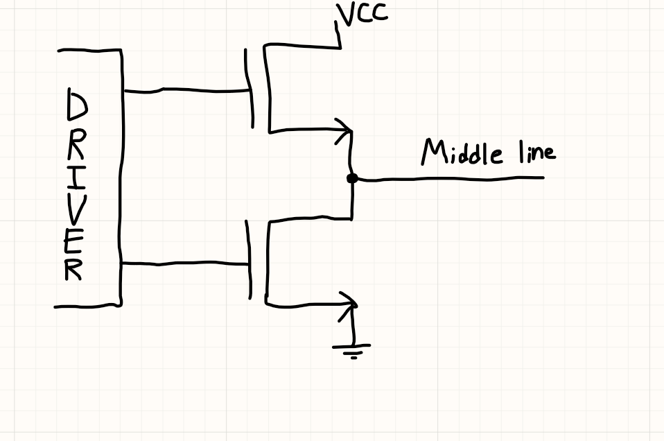
The main idea is, only one MOSFET is turned on at a time, resulting in either a flow of current from the + supply rail to the middle line, or from the middle line to the GND rail. If we connect the middle line to a motor lead, we can then draw current from it, or source current into it. But how is the middle line driven externally to facilitate this flow of current?

**3 Half Bridges**

The interior circuitry of a 3-phase BLDC motor can be thought of in the following way: 
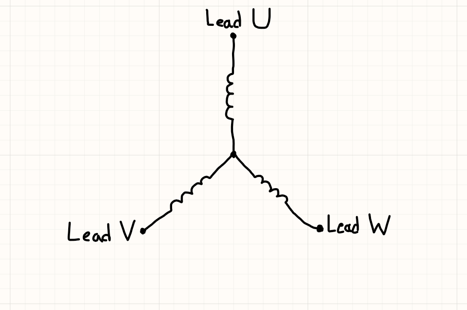
There are 3 leads, each directly connected to 1 of 3 windings (or phases). To drive the motor, commutation has to be done in a way which sets the magnetic polarity of the windings in a sequence that forces the rotor to continuously rotate. 

The path of current through the motor is always through 2 windings, and the third one is floating. So the H-bridge connected to 1 lead has its HS MOSFET ON, the H-bridge of another lead has its LS MOSFET ON, and the H-bridge of the last lead has both MOSFETs turned OFF (floating).

In total, there are 6 of those commutation configurations.

**Commutation Timing**

When I first learned about this, I assumed commutation for efficient rotor rotation could be done by simply repeating the following H-bridge configuration sequence, and by adjusting the rate at which configurations are changed to adjust the speed of rotation:
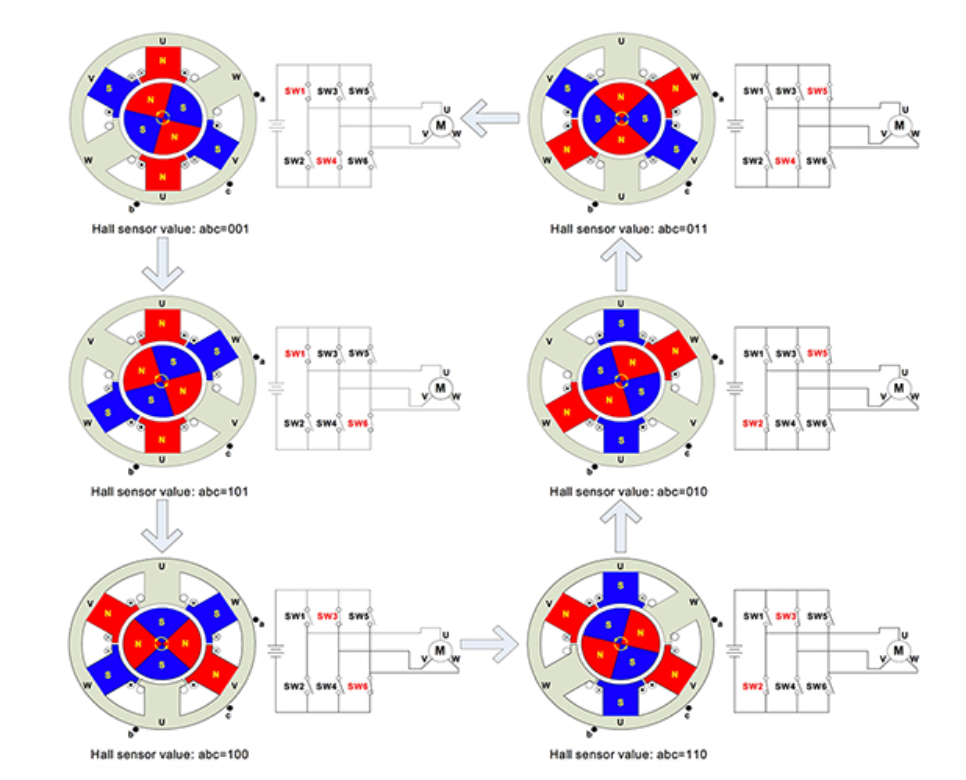
([Source](https://www.digikey.com/en/articles/how-to-power-and-control-brushless-dc-motors); Diagrams above depict an inrunner motor which first forces the north poles of the rotor to the south “V” coils of the stator, then the south poles of the rotor are foced to the “U” coils, then north poles are forced to south W coils, and so on…)
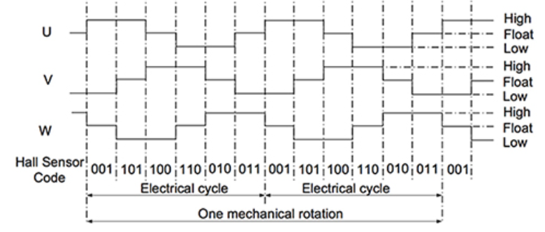
([Source](https://www.digikey.com/en/articles/how-to-power-and-control-brushless-dc-motors); The “state graph” above shows the states of thee UVW leads — driven by the H-bridges).

Driving the motor with constant commutation rates and without any reliance on feedback from the actual rotation of the motor would be considered “open-loop drive”: which produces an inefficient and non-continuous result (BLDCs are commonly only started in open-loop).

One common method of figuring out the right time to commutate is by measuring the back-EMF of the “floating coil”.

**BEMF Zero-crossing**

Though there are other methods (field oriented control - complicated; using integrated hall-effect sensors to let you know what particular rotor magnetic pole is at a particular location), this is the most common sensorless method I could find.

As the rotor rotates, the magnetic fields produced by the rotor’s magnets move through the coils. When a coil is floating, a significant EMF is induced across it (BEMF). This EMF can be measured to give insight on which stage of rotation the rotor is in.
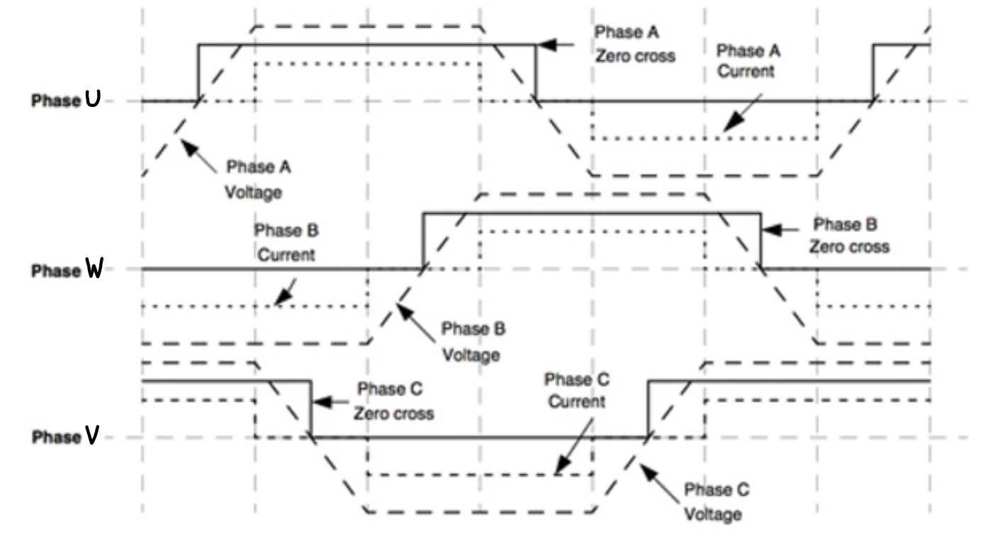
The hashed lines in the diagram above ([source](https://www.digikey.com/en/articles/controlling-sensorless-bldc-motors-via-back-emf)) represent the desired EMF waveform of each coil as the rotor turns. The dotted line is the forced state of each phase’s H-bridge as shown in the previous diagram. Notice that the EMF is saturated high when the H-bridge drives the phase high, and the EMF is saturated low when the H-bridge drives the phase low. However, when the H-bridge is not driving the phase (horizontal dotted line), the EMF across the the coil is cmpletely induced, and as it eventually falls below the voltage of the motor’s neutral point (when zero-crossing occurs), we get an idea of when to time the commutation. 

After the zero-crossing point occurs, ideally, the rotor spins another 30 degrees prior to the next H-bridge configuration (firmware which controls the H-bridges introduces a 30-degree phase lag — I tried to do this in software with a changing time delay).

**Zero-Crossing Detection**

BEMF is the voltage across the “floating coil”. In most drone BLDCs and in the ones I’m using, however, there is no access to the neutral point/node. Instead, a virtual neutral node is used, which consists of resistors in a Wye configuration ([source](https://www.digikey.com/en/articles/controlling-sensorless-bldc-motors-via-back-emf)): 
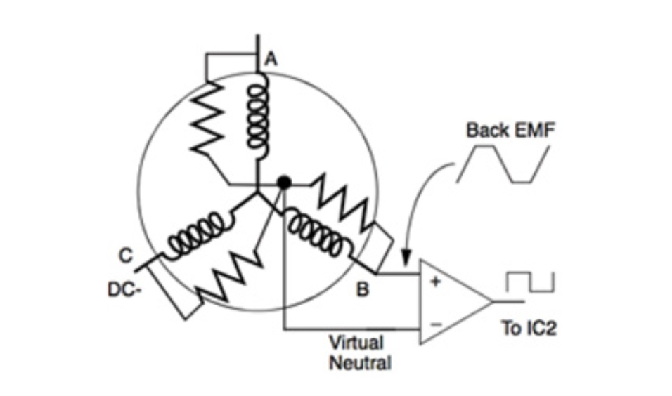

A comparator then compares the lead voltage with the virtual neutral voltage, and changes the state of its output when zero-crossing occurs. This output can be connected to an interrupt line of an MCU, notifying it when commutation should be done.

**Circuit Design**

The circuit design and component choice was influenced by [Phil’s Lab’s youtube video on ESCs](https://www.youtube.com/watch?v=dJjxcjJOlN0&t=302s), and [guser16’s ESC design](https://github.com/guser210/ESC).

### 2. ESC Testing
I then assembled a single ESC circuit on a perfboard, which consists of 3 half bridges, zero-crossing detection circuitry, and there’s an external STM32 MCU on a devboard which drove the H-Bridge drivers. The motor I controlled was an **AKK 1407 3500KV**, which is made for being powered with 3S and 4S LiPos. When selecting components / component values, I made sure they worked with a 3S LiPo.

The following video shows it in action: https://www.dropbox.com/scl/fi/h5kz7rpewur25fz3p134m/PerfESCDemoVideo.mp4?rlkey=im0dpoofihpynf49n5m05099o&dl=0

I interface with the ESC (through the STM32 MCU) using another STM32 Nucleo board, which uses the “Proshot” communication protocol (commonly used in FPV drone ESCs). There, bursts of four ~250kHz PWM pulses (one burst being encoded with 16 bits of data) are transmitted at 1kHz, and decoded by the ESC’s MCU using its timer peripherals. 

In the video, the speed was controlled using a program that sent UART data to the Nucleo board. The greater the speed, the larger the duty cycle of the signal which drives the HS MOSFET, and consequently, the greater the average current through the motor coils.

### 3. 4-in-1 ESC PCB Design
I decided to design a PCB containing 4 ESCs, so that one board could drive an entire quadcopter. I took influence from the ESC boards made by SpeedyBee:
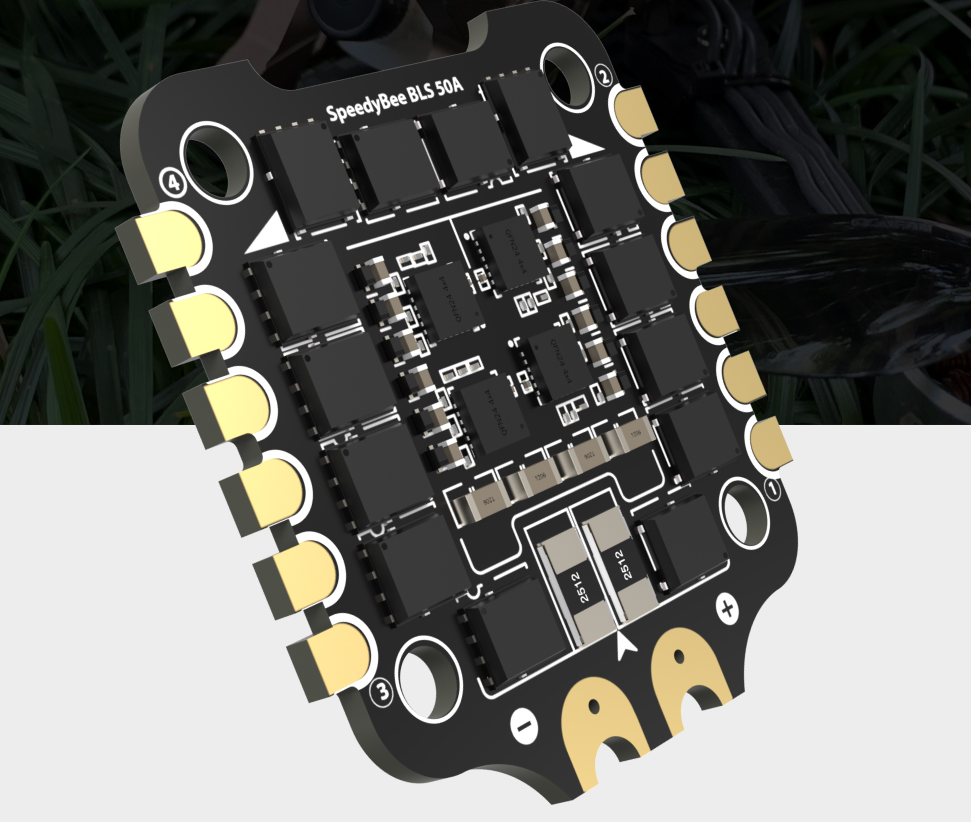

In my ESC testing, I found that I could get more than sufficient thrust with ~4A average current (while powering the ESC with a lab bench power supply). From this, I sized the PCB traces to heat up <20 C when driven to max. 
PCB Top             |  PCB Bottom
:-------------------------:|:-------------------------:
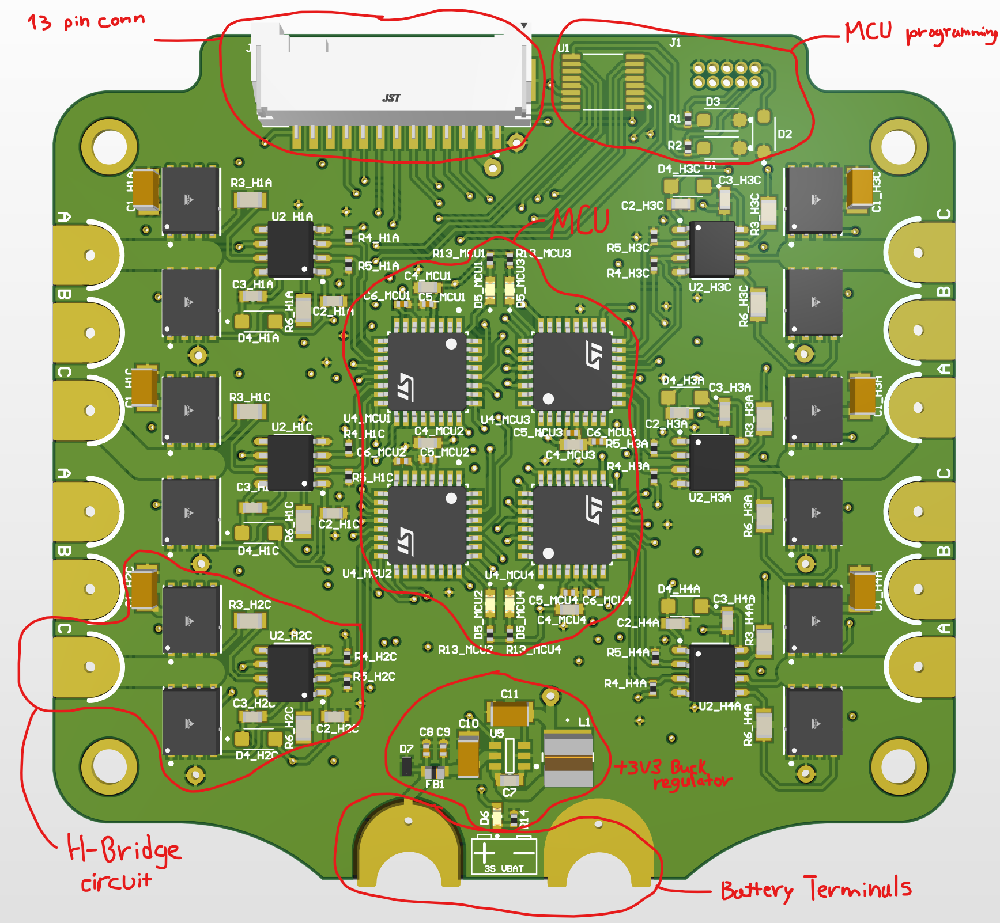  |  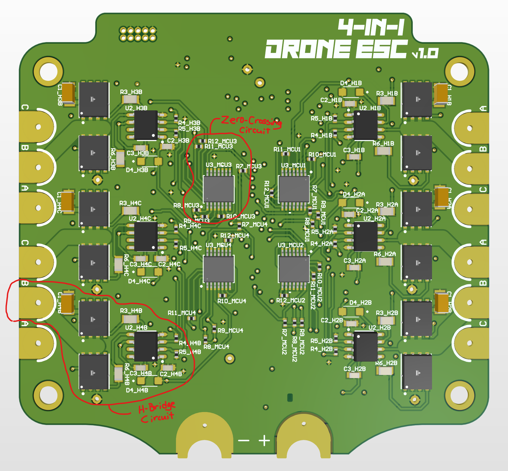

**13-pin connector**:

Used for interfacing the ESC board with the flight controller (FC)
- GND connection.
- 4 Proshot lines: used for FC to control the speed of the motors using PWM signals.
- 4 MCU Control/Debug lines (additional communication line for ESCs to FC; if motor rotation direction should be reversed)
- 1 Regulator Enable line: used to cut power from MCUs (to instantly turn off ESCs - though the H-bridge driver *LIN line can’t get pulled up, but HIN will be pulled down so no motor leads will be connected to VBAT).
- 2 SWD MUX lines: used for selecting which MCU interfaces with SWD lines.
- VBAT line: used to either power the FC or allow it to monitor the battery voltage.

**MCU Programming:**

JTAG socket for programming and debugging MCUs using SWD, and MUX for selecting which MCU is programmed/debugged.

**MCUs:**

4 STM32G070KBT6 MCUs used for decoding PWM signals from FC and controlling the H-Bridge drivers. There are also debug LEDs for each MCU.

**Zero-Crossing Circuits:**

Contains a 4 element open-collector comparator IC and resistors configured to produce a virtual neutral point. The lead voltages are then compared with the neutral point. The outputs connect to interrupt lines of the MCUs.

**H-Bridge Circuits:**

Half-Bridge circuits containing a half bridge driver, large motor lead pad, pullups and pulldowns for driver inputs, bypass capacitors, and 30V 24A n-channel MOSFETs.
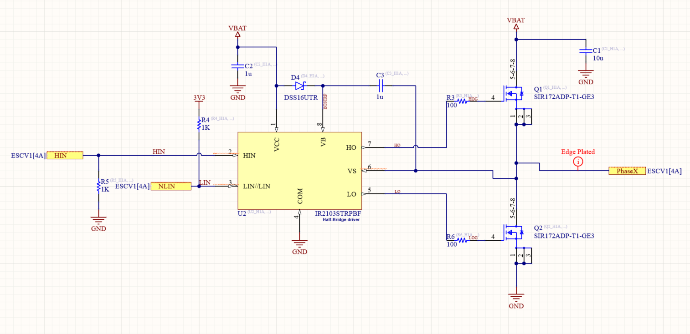

**+3V3 Buck Regulator:**

Generates +3V3 line for powering MCUs and MUX chip. 1A maximum output. MCU **typical current consumption is ~7mA**, but can reach up to 100mA.

**Battery terminals:**

Large edge-plated pads for connecting the board to the battery.

#### Schematics:
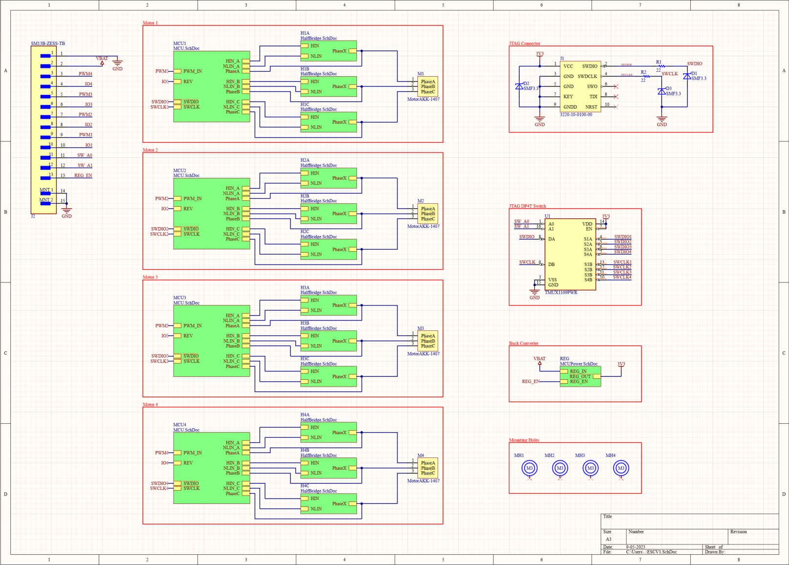
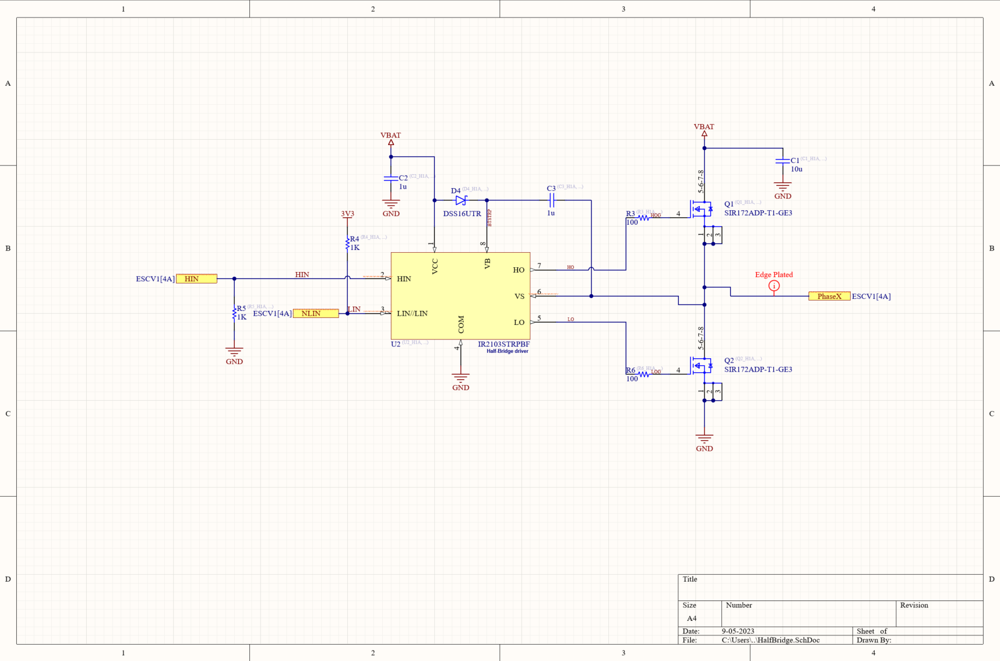
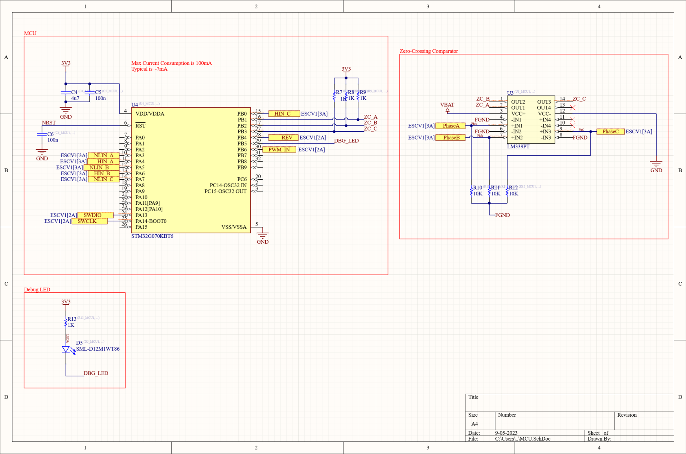
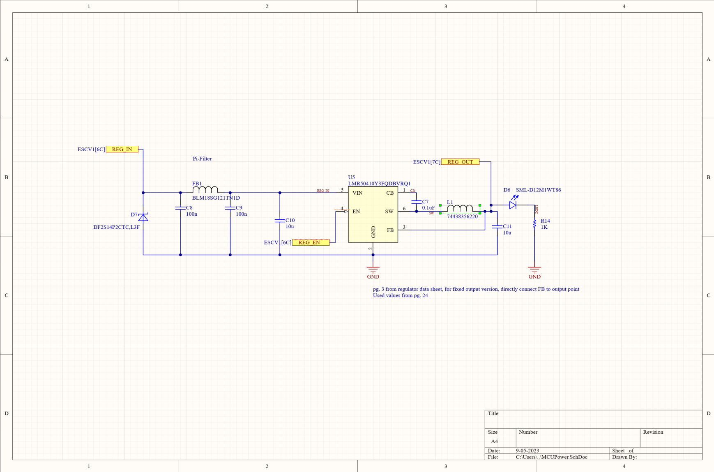
